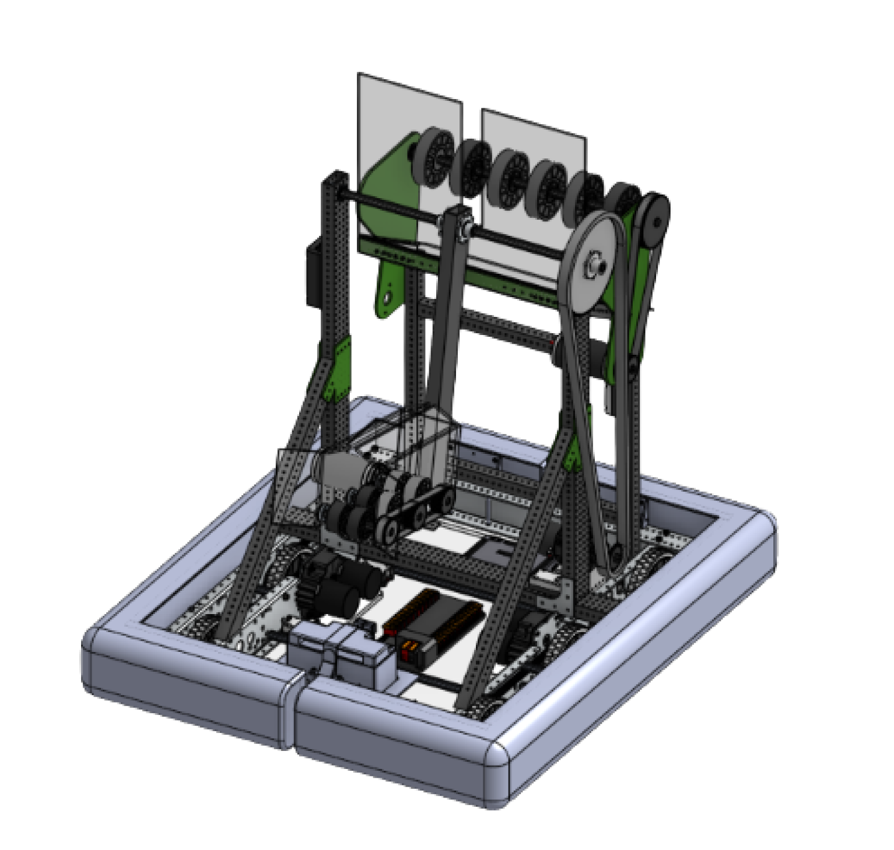
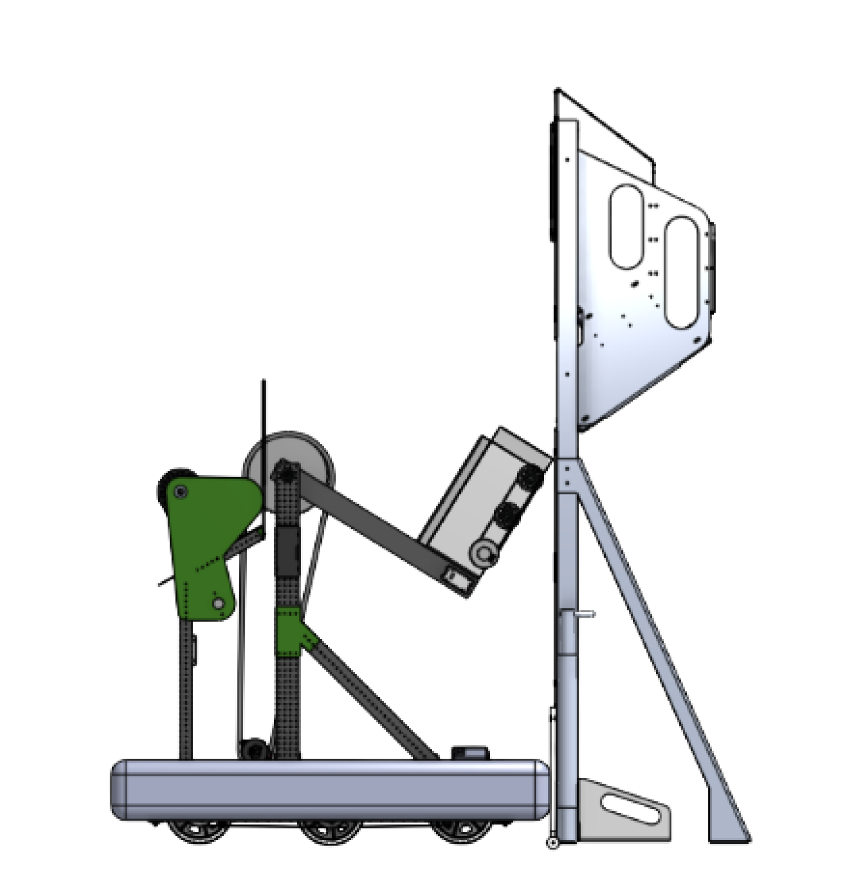

# CoreBot - Robô para o Jogo FRC 2025

## Visão Geral & Objetivos

### Propósito Principal
O **CoreBot** foi projetado para o jogo **FRC 2025**, destacando-se em:

- Pontuar elementos de coral nos níveis L1, L2 e L3 do Recife.
- Remover algas do Recife.
- Coletar coral de um lado e pontuar do outro lado do robô.

### Prioridades de Design
- **Custo reduzido**: Focado em acessibilidade para equipes com recursos limitados.
- **Velocidade adequada**: Equilíbrio entre mobilidade e estabilidade.
- **Modularidade**: Componentes adaptáveis às preferências da equipe.

### Inovações Principais
- **Pontuação bilateral**: Capacidade única de coletar e pontuar em lados opostos do robô.

### Regras do Jogo que Influenciaram o Design
- Requisitos de pontuação em L1–L3.
- Mecânica de remoção de algas.

---

## Especificações Técnicas

| **Categoria**         | **Detalhes**                                                                                 |
|-----------------------|----------------------------------------------------------------------------------------------|
| **Dimensão**          | Altura: 1M, Peso: Máximo 40kg                                                                |
| **Sistema de tração** | Tank                                                                                        |
| **Motores**           | - Pivô: 1x NEO (com encoder integrado)                                                      |
|                       | - EndEffector: 1x motor DC                                                                  |
|                       | - Backpack: 1x motor DC                                                                     |
|                       | - Tração: 4x motores (escolha da equipe)                                                    |
| **Automação**         | - Encoder relativo (integrado ao motor NEO)                                                 |
|                       | - Sensores adicionais opcionais                                                              |
| **Sistemas de Controle** | Configurável de acordo com a equipe (ex: RoboRIO + SPARK MAX/TalonFX)                       |

---

## Design Mecânico

### Estrutura do Chassi
- **Materiais**: Alumínio (estrutura principal) + policarbonato (painéis leves).
- **Montagem**: Parafusada para modularidade e fácil manutenção.

### Mecanismos Críticos
- **EndEffector**: Mecanismo central de pontuação (design personalizável pela equipe).
- **Junta**: Subsistema de braço com redução de 3:1 (corrente/roda dentada) para movimentos precisos.

### Durabilidade & Segurança
- Suportes reforçados para a superestrutura.
- Mínimo de peças personalizadas para confiabilidade.

---

## Software & Controles

### Programação
- **Framework**: Java command-based (WPILib).
- **Autônomo**: Pode-se usar bibliotecas para autonomous, ficando de preferência da equipe.

### Sensores & Feedback
- **Encoder relativo do NEO** permite ajuste PID para posicionamento da junta.

### Ferramentas de Depuração
- **Shuffleboard**: Monitora valores PID, status dos motores e dados dos sensores.

---

## Subsistemas & Funcionalidades

### Chassi Tank
- **Função**: Mobilidade e controle do chassi.
- **Componentes**: 4x motores + 4x controladores SPARK MAX.

### Backpack (Mochila)
- **Função**: Coleta coral da Estação de Coral deitado e pontua em L1.
- **Componentes**: 1x motor DC + SPARK MAX + rodas flexíveis de 4 polegadas.

### Junta (Grau de Liberdade)
- **Função**: Posiciona o EndEffector para pontuação em L2/L3.
- **Componentes**: 1x motor com caixa de redução 3:1 + sistema de corrente/roda dentada.

### EndEffector
- **Função**: Interage diretamente com os elementos do jogo (pontuação do coral/remoção de algas).
- **Componentes**: Mecanismo com 1 motor e rodas flexíveis de 2.5 polegadas (design personalizável).

---

## Montagem & Manutenção

### Passos Críticos:
- Ajuste da tensão da corrente da junta (corrente #35).
- **Calibração**: Zerar o encoder do NEO após a montagem e garantir que o robô vai ser ligado na sua posição inicial.

---

## Guia do Usuário

### Controles do Driver:
- **Botão A**: Pontuação no L1 (Pontuação via Backpack)
- **Botão B**: Pontuação no L2 (Posicionamento da junta no L2 -> Pontuação)
- **Botão Y**: Pontuação no L3 (Posicionamento da junta no L3 -> Pontuação)
- **Gatilho Direito**: Intake pela backpack (Coleta via Backpack -> Armazenamento Backpack)
- **Gatilho Esquerdo**: Pontuação no L1 (Coleta via Outtake)
- **Botão Start**: Posição Home (Posicionamento da junta na posição 0)

### Fluxo de Ações:
1. Posicionamento na junta -> Coleta pelo EndEffector → Armazenamento → Posicionamento da junta → Pontuação -> Retorno do EndEffector para o home
2. Intake via backpack -> Armazenamento -> Pontuação

### Problemas Comuns:
- **0 do encoder relativo**: Verifique firmware do SPARK MAX e conexões de energia.
- **Encoder descalibrado**: Rezerar o encoder do NEO via software.

---

## Melhorias Futuras
- Adicionar **vision processing** (ex: Limelight) para alinhamento autônomo.
- Atualizar para **tração swerve** (se houver recursos disponíveis).
